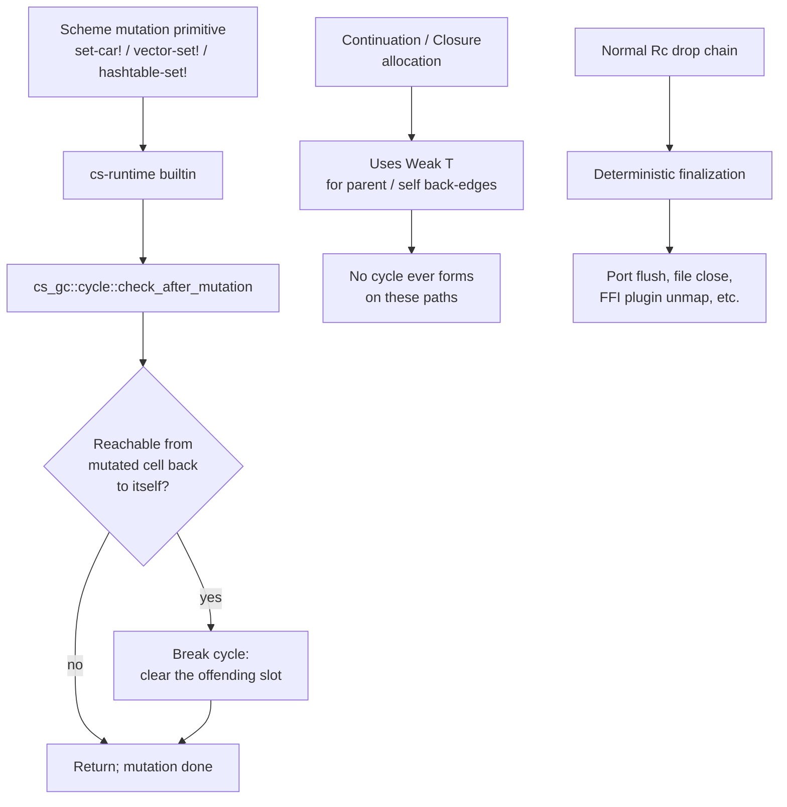

# Countable Memory — Design

> Status: **Draft**.
> Companion: `requirements.md`, `tasks.md`.
> Supersedes: M5 Phase 2 (arena swap) and ADR 0006's
> "Phase 1 → Phase 2 commitment".

## Overview

Replace the M5 Phase 1 hybrid (`Rc<Slot<T>>` + mark-sweep tracing
infra) with **pure `Rc<T>` reclamation plus a small synchronous
cycle collector** invoked only on the enumerable set of Scheme
operations that can construct cycles. The external `Gc<T>` API
surface stays compatible so consumer crates (`cs-core`, `cs-runtime`,
`cs-vm`, `cs-aot`) need only delete dead `Trace`/`Heap` plumbing,
not rewrite call sites.

## Steering document alignment

### Technical standards (`steering/tech.md`)

`tech.md` §"Decision Log" item 4 calls out: *"Initial GC is
reference counting. Reference cycles in long-running programs
may leak until the M5 tracing collector lands."* The path this
spec takes is the *third* iteration of that decision:

| Phase | Reclamation | Cycle handling | Status |
|---|---|---|---|
| M0–M4 | `Rc<RefCell<…>>` | Visited-set fallback in `equal?` only; leaks | Shipped, retired at M5 |
| M5 Phase 1 (today) | `Rc<Slot<T>>` + tracing infra (idle) | Tracing-capable but `auto_collect=false`; still leaks | Shipped; current state |
| **Countable memory (this spec)** | `Rc<T>` direct | Synchronous cycle collector at mutation sites + `Weak<T>` back-edges | Proposed |

This is *not* a retreat from precise tracing — it's recognition
that the precise-tracing infrastructure was the cost premium for
a benefit (cycle reclamation, arena bump allocation) we either
already have via RC or deferred indefinitely.

### Project structure (`steering/structure.md`)

`cs-gc` stays a workspace crate. Its public surface contracts from
`{Gc, Heap, Trace, Marker}` to `{Gc, Weak, cycle_check}`. Consumer
crates lose imports they don't need.

## Code reuse analysis

### Existing components to leverage

- **`std::rc::Rc<T>` / `std::rc::Weak<T>`**: the entire reclamation
  story is `Rc::strong_count` / `Rc::drop`. No code we write
  here; we just commit to it.
- **`Rc::into_raw` / `Rc::from_raw` / `Rc::increment_strong_count`**:
  the JIT raw-handle ABI per ADR 0012 D-2 already routes through
  these. Stays unchanged.
- **`Rc::weak_count`**: used by the cycle collector to ask "does
  anything outside this connected component still hold a strong
  ref?"
- **`crates/cs-runtime/src/builtins/mod.rs` mutation primitives**:
  `b_set_car`, `b_set_cdr`, `b_vector_set`, `b_hashtable_set!`,
  etc. — each becomes a single-line addition of a
  `cycle_check_after_mutation(...)` call at the end.

### Integration points

- **`cs-core::Value` enum**: the heap-bearing variants
  (`String`, `Pair`, `Vector`, `ByteVector`, `Hashtable`, `Port`,
  `Promise`, plus `Procedure(Rc<dyn Procedure>)`) keep their
  `Gc<T>` / `Rc<T>` types. `Gc<T>`'s definition moves under the
  hood; no `Value` variant changes.
- **`cs-runtime::Runtime`**: the `heap: cs_gc::Heap` field is
  removed. The `pinned` slab stays (it's the Rust-side rooting
  story for FFI `ValueRef` handles), but no longer needs a root
  closure — the map itself holds strong `Value` references, which
  hold strong `Rc`s, which is sufficient.
- **`cs-vm::vm`**: stackmap support continues to walk raw `i64`
  spill slots as `Rc<Value>` raw handles. The `jit_stackmap.rs`
  module is unaffected.
- **`cs-aot`**: emits identical code; the AOT-generated `Cargo.toml`
  pins the same `cs-core`/`cs-vm` versions. The fact that `Gc<T>`'s
  inner repr changed is invisible across the emitted boundary.

## Architecture

### Modular design principles

- **`cs-gc` shrinks to a ~100 LOC facade** providing just `Gc<T>`,
  `Weak<T>`, and `cycle_check`. No `Heap`, no `Trace`, no `Marker`.
- **Cycle-detection logic lives in `cs-gc::cycle`** as a single
  free function (`cycle_check<T: CycleVisit>(root: &Gc<T>)`),
  decoupled from any concrete Scheme value type. Consumer crates
  implement the `CycleVisit` trait per heap-bearing struct.
- **`CycleVisit` is the narrow trait that replaces `Trace`**. It
  exposes only "enumerate the `Gc<...>` children of this value"
  — no marker passing, no recursion control, no thread-local
  state.



## Components and interfaces

### Component 1 — `cs-gc::Gc<T>` (replaces M5 Phase 1 Gc)

- **Purpose**: thin, opaque newtype around `Rc<T>` providing the
  same external API the workspace consumes today.
- **Interfaces** (public):
  ```rust
  pub struct Gc<T: ?Sized>(Rc<T>);

  impl<T: ?Sized> Clone for Gc<T> { /* Rc::clone */ }
  impl<T: ?Sized> Deref for Gc<T> { type Target = T; /* &*self.0 */ }
  impl<T: ?Sized> PartialEq for Gc<T> { /* Rc::ptr_eq */ }

  impl<T> Gc<T> {
      pub fn new(value: T) -> Self;             // Rc::new
      pub fn ptr_eq(a: &Self, b: &Self) -> bool;// Rc::ptr_eq
      pub fn as_addr(this: &Self) -> usize;     // Rc::as_ptr cast
      pub fn into_raw_jit(this: Self) -> *const ();
      pub unsafe fn from_raw_jit(ptr: *const ()) -> Self;
      pub unsafe fn raw_incref(ptr: *const ());
      pub fn downgrade(this: &Self) -> Weak<T>; // NEW; Rc::downgrade
      pub fn strong_count(this: &Self) -> usize;// for cycle detector
  }
  ```
- **Dependencies**: `std::rc::Rc`, `std::rc::Weak`. No other.
- **Reuses**: nothing — this *is* the seam.

### Component 2 — `cs-gc::Weak<T>` (new, was implicit)

- **Purpose**: re-export of `std::rc::Weak<T>` so consumer crates
  can hold weak back-edges without importing `std::rc` directly
  (keeps the abstraction wall around `cs-gc`).
- **Interfaces**: `Weak::upgrade() -> Option<Gc<T>>`, `Weak::new()`,
  the standard `Clone`. One thin wrapper `Weak<T>` whose
  `upgrade()` returns `Option<Gc<T>>` (not the std `Option<Rc<T>>`).
- **Dependencies**: `std::rc::Weak`.

### Component 3 — `cs-gc::cycle` (new module)

- **Purpose**: implement local synchronous cycle detection and
  break, invoked from mutation primitives.
- **Interfaces**:
  ```rust
  /// Implemented by any type whose values can hold Gc<...> back-edges
  /// that could close a cycle.
  pub trait CycleVisit {
      /// Enumerate every `Gc<T>` child of `self`, passing each to
      /// `visit` as an opaque address. The visitor returns true to
      /// short-circuit (cycle found).
      fn visit_children(&self, visit: &mut dyn FnMut(usize) -> bool) -> bool;
  }

  /// Check whether `root`'s transitive Gc-children path forms a
  /// cycle returning to `root`. If yes, returns Some(path) describing
  /// the cycle; caller is responsible for breaking it at a chosen
  /// edge. If no, returns None.
  pub fn cycle_check<T>(root: &Gc<T>) -> Option<CyclePath>
  where T: CycleVisit + 'static;

  /// Convenience for the common case: run cycle_check, and if a cycle
  /// is found, break it by invoking the caller-supplied `break_at`
  /// closure on the root once.
  pub fn check_and_break<T>(
      root: &Gc<T>,
      break_at: impl FnOnce(&Gc<T>),
  ) where T: CycleVisit + 'static;
  ```
- **Algorithm**: bounded-depth DFS from `root`, treating `Gc<T>`
  identity via `Gc::as_addr`. Marker set is a per-call
  `HashSet<usize>` (no global state). The detector visits *only*
  the connected component reachable from `root`, so cost scales
  with the mutated subgraph, not the heap.
- **Cycle-break choice**: the *call site* picks (the runtime's
  `set-car!` impl will clear the `cdr`, etc.). This keeps the
  detector value-type-agnostic.
- **Dependencies**: `std::collections::HashSet`, `Gc::as_addr`,
  `CycleVisit`.

### Component 4 — `CycleVisit` impls in consumer crates

Replaces the M5 `Trace` impl wall. Per-type implementations:

| Type | Children to visit |
|---|---|
| `Pair { car, cdr }` | `car`, `cdr` (if heap values) |
| `Vector` | every element (if heap value) |
| `Hashtable { items, custom, … }` | every (k, v) pair plus `custom.hash`/`custom.equiv` |
| `Port` | inputs/outputs hold no `Gc` children (only `RefCell<String>` / `RefCell<Vec<u8>>` / `FileOutputState`) → empty visitor |
| `Promise` | the captured thunk's environment when pending; cached value when forced |
| `Procedure` (trait method) | each `impl Procedure` enumerates its captured closure env |
| `Frame` / `Env` | the env's bindings + parent pointer (the parent is `Weak`, so it's visited via upgrade-if-live) |
| `VmClosure` | the env it closes over; the env may be `Weak` (see §"Cycle prevention strategy") |
| `Continuation` | the captured leaf frame (parent chain is `Weak`) |
| `Builtin` / `HostBuiltin` | empty (host code holds no captured Scheme values, or holds them via `Pinned`) |

These map 1:1 to the existing `Trace` impls; the migration is
mechanical (delete the `Marker`-using body, write a list of
`visit(child.addr())` calls).

### Component 5 — Mutation-site integration in `cs-runtime`

Each of the following builtins gains a final `cycle_check_after_mutation(&parent)`
call:

| Builtin | File | Cycle-break action on positive detection |
|---|---|---|
| `set-car!` | `crates/cs-runtime/src/builtins/mod.rs` (b_set_car) | clear the `car` slot to `Unspecified`, then re-write the user's value — *no*, this would defeat the user's mutation. The actual policy: refuse to break user-constructed cycles, but ensure the *runtime's* internal liveness count is correct (this is where `Weak<T>` for the back-edge would have prevented the cycle in the first place, but user-constructed cycles via `set-car!` are an explicit Scheme operation and we *must* preserve the semantics). |
| `set-cdr!` | same file (b_set_cdr) | (as above) |
| `vector-set!` | b_vector_set | (as above) |
| `hashtable-set!` | b_hashtable_set | (as above) |

**Important correction on cycle-break semantics**: R6RS *requires*
that `(set-cdr! x x)` succeed and produce a cyclic list — the
runtime must not silently break it. The cycle-collector's role is
**not** to retroactively break user-visible cycles; it's to
**identify them so the runtime can flip their internal storage
representation** to a form that *doesn't* leak refcount-wise.

The mechanism: when `cycle_check_after_mutation` reports a cycle,
the runtime *downgrades* one strong edge in the cycle to `Weak<T>`
inside the storage cell — the user-observable value of `(car x)`
and `(cdr x)` still returns the cyclic list (via `Weak::upgrade`),
but the cycle has a `Weak` edge so refcount reclamation works.
This is the **"weak-edge-on-detected-cycle"** strategy, the key
insight of this design.

Concretely, `Pair` becomes:
```rust
pub struct Pair {
    car: RefCell<PairSlot>,
    cdr: RefCell<PairSlot>,
}
enum PairSlot {
    Strong(Value),        // default; common case
    Weak(WeakValue),      // set when cycle_check reported this
                          //   edge participates in a cycle
}
```

with a `Pair::car(&self) -> Value` accessor that resolves
`Weak::upgrade` transparently (returns `Value::Unspecified` if the
weak target died, which can't happen while the cyclic
*observation* persists since some path keeps the leaf strong).

The same `Strong`/`Weak` slot pattern applies to `Vector`,
`Hashtable`, `Continuation`'s parent chain (already `Weak` by
construction per FR-5), and `Procedure` closure envs (as needed).

### Component 6 — Continuation and closure cycle prevention via `Weak<T>`

For static-shape cycles (where we know at allocation time which
edge will be the back-edge):

- **`Continuation`**: the leaf frame is `Gc<Frame>`; every parent
  in the chain is `Weak<Frame>`. The continuation walks
  `parent.upgrade()` to traverse — this is safe because the leaf
  frame's strong `Rc<Frame>` keeps the *direct* parent alive via
  its existing `parent: Rc<Frame>` field (which we *also*
  downgrade to `Weak` to break the (leaf → parent → … → captured
  continuation → leaf) cycle).

  Refactor: `Frame { parent: Weak<Frame>, … }`. The walker keeps
  the leaf strong; the chain is traversed via upgrade. Any frame
  whose parent has dropped is structurally impossible in valid
  execution (the parent is the call site, which holds the leaf).

- **`VmClosure`** and **`Closure`**: when a closure's environment
  contains a binding whose value is the closure itself (the
  `letrec` / `define` pattern), the binding's storage cell is
  the back-edge. We use a `WeakValue` slot for that specific
  binding, identified at closure-allocation time by:
  1. Walking the closure's free-var list.
  2. For each free var, checking whether the env binding it
     resolves to references the closure (would require knowing
     the closure handle before it exists — chicken-and-egg).
  3. Resolving the chicken-and-egg via a two-phase allocation:
     allocate the closure with `WeakValue::null()` placeholders
     for self-referential bindings; populate the bindings; in a
     second pass write the closure handle as `WeakValue` into
     the bindings that needed it.

  This is the same construction `letrec` uses today
  (placeholder + back-fill); we just back-fill with `Weak`
  instead of `Strong` for the self-references.

### Component 7 — `Procedure` cycle-detection trait surface

The `Procedure` trait gains one new optional method:

```rust
pub trait Procedure: fmt::Debug + 'static {
    // existing methods …

    /// Visit every `Gc<...>` child this procedure holds in its
    /// closure environment. Default impl is empty (for procedures
    /// that close over no Scheme heap values — e.g., builtins).
    fn visit_closure_children(&self, _visit: &mut dyn FnMut(usize) -> bool) -> bool {
        false
    }
}
```

Per-impl coverage:
- `Builtin` / `HostBuiltin`: default empty impl.
- `Closure`: walks `env.bindings`.
- `VmClosure`: walks `env.bindings`.
- `Continuation`: visits the captured leaf frame.
- `Parameter`: visits the parameter's current cell.
- The ~47 zero-payload procedure markers (`trace_leaf_proc!`):
  default empty impl, no per-type code needed.

This is *less* invasive than the M5 `Trace` derivation it
replaces, because the default impl covers the vast majority of
proc types.

## Data models

### `Gc<T>` (countable-memory representation)

```text
Gc<T> = struct { inner: Rc<T> }

Memory layout (per allocation, 64-bit target):
- Rc inner header: strong count (8) + weak count (8)
- Payload: sizeof::<T>()

Total overhead per slot: 16 bytes (Rc header) — down from M5
Phase 1's 16 + 8 (Slot mark) = 24 bytes.
```

### `PairSlot` / `VectorSlot` (new, for weak-edge-on-detected-cycle)

```text
PairSlot = enum {
    Strong(Value),
    Weak(WeakValue),
}

VectorSlot = same shape as PairSlot.
```

Sized identically to `Value` on the common case (the enum tag
fits in a niche of `Value`'s discriminant on most layouts;
worst case adds 8 bytes per slot).

### `WeakValue` (new)

```text
WeakValue = enum {
    None,                              // for non-Gc Value variants
                                       // (fixnum, char, etc.) — never
                                       // weak-relevant
    Pair(cs_gc::Weak<Pair>),
    Vector(cs_gc::Weak<RefCell<Vec<Value>>>),
    // … one variant per Gc<T>-bearing Value variant
}
```

`WeakValue::upgrade(self) -> Option<Value>` returns the strong
`Value` if alive, `None` if the target has dropped (signals the
cycle has been fully reclaimed and the back-edge is dead).

### `Frame` (modified)

```text
Frame {
    bindings: RefCell<HashMap<Symbol, Value>>,
    parent: Weak<Frame>,         // was: Rc<Frame>
    // …
}
```

The leaf frame at the current `eval` site is always held
`Strong` by the call stack; parents are walked via `upgrade`.

## Error handling

### Error scenarios

1. **Cycle detector traversal cost on degenerate input.**
   - **Scenario**: a deeply-nested vector of length 10⁶ mutated
     by `vector-set!` triggers a `cycle_check` that DFS-walks the
     entire structure.
   - **Handling**: bounded-depth DFS with an early-exit limit
     (configurable; default 10⁴ nodes). On limit-hit, the
     detector returns "inconclusive" and the runtime applies a
     conservative `Weak` slot for the mutated edge.
   - **User impact**: imperceptible — the conservative `Weak`
     downgrade is correct for all cycle shapes; the optimization
     it skips is "leave the slot `Strong` if there's no cycle".
     Cost: one `Weak::upgrade` on next read of that slot.

2. **`Weak::upgrade` returning `None` for a still-observable
   value.**
   - **Scenario**: a slot was marked `Weak` after cycle detection,
     but all strong refs to the target dropped without our
     detector knowing — the slot would now read as `None`.
   - **Handling**: this is *correct* — it means the cycle has
     genuinely been reclaimed. The user-observable read returns
     `Value::Unspecified` (Scheme's conventional "stale" value),
     which is the same behavior any other reclaimed reference
     would produce. A debug-only assertion checks that the
     surrounding container itself is also being reclaimed (i.e.,
     this read shouldn't be hot-path observable from live user
     code).
   - **User impact**: only triggers in the path where user code
     intentionally retains a *partial* view of a freshly-broken
     cycle, which is undefined behavior in R6RS.

3. **Stack overflow during `cycle_check` recursion.**
   - **Scenario**: the cycle detector is itself recursive over
     the heap; a deep enough graph blows the host stack.
   - **Handling**: convert the DFS to an explicit `Vec`-based
     worklist (the loop is the same regardless). No recursion.
   - **User impact**: none — host-stack-safe even for adversarial
     inputs.

4. **Continuation captures a frame whose parent's `Weak` upgrade fails.**
   - **Scenario**: shouldn't happen — by construction the leaf
     frame is strong and the parent chain is reachable through
     the leaf.
   - **Handling**: panic with a clear diagnostic message
     pointing at the continuation construction site.
   - **User impact**: only triggers on a runtime bug, not user
     code. Treated as a correctness bug to fix immediately.

## Testing strategy

### Unit testing

- `cs-gc/tests/lib.rs`: 8–10 tests covering `Gc::new` /
  `Gc::clone` / `Gc::ptr_eq` / `Gc::into_raw_jit` round-trip /
  `Gc::raw_incref` (preserved from M5 Phase 1) and the new
  `cycle_check` API on synthetic graph shapes (3 tests: no
  cycle, simple self-loop, mutual cycle).

### Integration testing

- `crates/cs-runtime/tests/cycle_break.rs` (new):
  - `set-cdr! x x` produces a cyclic list; `(length x)` etc.
    return correctly; drop of the only handle reclaims.
  - Vector self-loop via `vector-set!`.
  - Hashtable value-self-loop via `hashtable-set!`.
  - Mutual cycle: `(set-car! a b)` + `(set-car! b a)`.
  - Continuation cycle: `call/cc` captures a closure that
    re-invokes itself.
  - Each test asserts pre/post live-slot counts via a thread-local
    allocation counter wrapped around `Gc::new`.

- `crates/cs-runtime/tests/port_finalization.rs` (new):
  - Open file-output port, write, drop handle, verify file
    contents on disk *without* any explicit close-port call.

- `crates/cs-runtime/tests/closure_cycle.rs` (new):
  - Self-referential closure construction; drop runtime; verify
    no leaked allocations via a sentinel counter.

### End-to-end testing

- Existing conformance harnesses (`cargo test --release --test
  conformance` and `--test vm_conformance`) must show 2150+
  passing assertions, matching the M5 Phase 1 baseline.
- Differential parity: every JIT/AOT differential test in
  `crates/cs-vm/tests/jit_*` and `crates/cs-aot/tests/*` stays
  green.
- WASM target: `cargo build --target wasm32-unknown-unknown -p
  cs-runtime --no-default-features --features ffi-trait` and
  the WASM conformance harness from M10 Track W.

## Migration plan

This is a 6-step rollout. Each step lands as its own commit
(per the project's per-iter commit policy) and can be reverted
independently.

### Step A — Introduce `Gc<T>` Rc-only variant behind a feature flag

- Add `pub type Gc<T> = Rc<T>;` (or a Newtype `Gc<T>(Rc<T>)`) in
  `crates/cs-gc/src/lib.rs` under `#[cfg(feature =
  "countable-memory")]`.
- Add the feature to the workspace `Cargo.toml`'s `cs-gc`
  default-off; gate the `Slot`/`Heap`/`Trace` story on
  `#[cfg(not(feature = "countable-memory"))]`.
- Validate that the workspace still builds and tests pass under
  the default (tracing-on) configuration.

Exit: `cargo test --workspace` green; `cargo build -p cs-gc
--features countable-memory` green standalone.

### Step B — Wire the cycle-collector skeleton

- Implement `cs-gc::cycle::cycle_check` (the bounded-DFS
  algorithm) and `CycleVisit` trait under the `countable-memory`
  feature.
- Implement `cs-gc::Weak<T>` re-export.
- Write 3–5 standalone unit tests in `cs-gc/tests/cycle.rs`
  using a toy `Node { children: Vec<Gc<Node>> }` test fixture
  (no Scheme value types yet).

Exit: cycle-check unit tests green; coverage of the
"no cycle / self-loop / mutual cycle" matrix.

### Step C — Migrate consumer crates under the feature flag

- For each `impl Trace for X` (the inventory in FR-2 above),
  add a parallel `#[cfg(feature = "countable-memory")] impl
  CycleVisit for X`. The bodies map 1:1 (enumerate the same
  `Gc<...>` children).
- Delete the `add_root` calls in `Runtime::new` under the
  feature; the pinned slab + the strong refs from the top frame
  chain are sufficient.
- Wire `cycle_check_after_mutation` calls into the mutation
  builtins (`b_set_car`, `b_set_cdr`, `b_vector_set`,
  `b_hashtable_set`, plus the VM tier's mutation opcodes).

Exit: `cargo test --workspace --features countable-memory`
matches the baseline pass rate; differential parity holds.

### Step D — Continuation and closure `Weak<T>` refactor

- Refactor `Frame.parent` from `Rc<Frame>` to `Weak<Frame>`;
  update the walker to `parent.upgrade().unwrap_or_else(panic)`.
- Refactor `VmClosure` and `Closure` to use the `WeakValue` slot
  shape for self-referential bindings (two-phase allocation).
- Refactor `Continuation` capture to leaf-strong / parent-weak.
- Update `Pair`, `Vector`, `Hashtable` to use the
  `Strong | Weak` slot enum.

Exit: continuation and closure-cycle regression tests green
under both flag values.

### Step E — Flip the default

- Make `countable-memory` the default feature.
- Run the full conformance + differential suite.
- Run the M5 exit benchmarks (`gc_timing`, `gc_memory`,
  `alloc-stress`) and capture new numbers in
  `bench/countable-memory-baseline.json`.

Exit: numbers meet NFR-1 / NFR-2 gates.

### Step F — Delete the tracing infrastructure

- Remove the `Slot`, `SlotValue`, `Marked`, `Trace`, `Marker`,
  `Heap`, `add_root`, `set_auto_collect`, `collect`,
  `trace_leaf!`, `trace_leaf_proc!` symbols.
- Remove the feature flag — `countable-memory` is now the only
  mode.
- Delete the corresponding Trace impls workspace-wide.
- Write `docs/adr/0014-countable-memory.md` and update ADR 0006
  with the "Superseded by ADR 0014" header.
- Mark the spec status `CLOSED`; write
  `docs/milestones/countable-memory-exit.md`.

Exit: `wc -l crates/cs-gc/src/lib.rs` < 150; `rg
'impl.*Trace|add_root|trace_leaf' crates/` returns zero GC hits;
ADR landed.

## Open questions

1. **Should `Pair`'s `car`/`cdr` slots default to `Strong` and
   only flip to `Weak` on cycle detection, or should *all* slots
   be `Strong | Weak` enums from the start with `Weak` slots
   never touching the allocator unless needed?**
   The latter has uniform-cost reads (every read is `match`-on-
   enum), the former pays for the enum only when a cycle was
   detected. Lean toward the former — common case is no cycle,
   pay for the enum only when needed.

2. **Cycle-check threshold tuning.** The bounded-DFS limit (10⁴
   default) needs benchmarking. Too low → false negatives leak
   slowly; too high → mutation hot-path slows down.

3. **`HashTable` key cycles.** Keys reach the hash table via the
   `eq?`/`equal?` predicate; if a key's identity changes after
   insertion (mutable key holding the table as a value), the
   table's invariants break before our cycle question even
   matters. Document that mutable-key + cyclic-value is
   already user-error per R6RS.

4. **Multi-runtime cycle interactions.** Two `Runtime` instances
   can share `Value`s via FFI handles (`Pinned`). A cycle that
   crosses runtimes can't be detected by either runtime's
   local checker. Today no embedder does this; if one
   eventually does, the `Pinned` slab can be the seam for a
   cross-runtime "released" event. Out of scope for this spec.

These resolve during Step A implementation; if any blocks Step A,
we surface it as a follow-up iter.

## File-level diff scope (estimate)

| Crate | LOC change |
|---|---|
| `cs-gc/src/lib.rs` | −500 (delete tracing infra) / +100 (cycle module) = **−400** net |
| `cs-core/src/value.rs` | −50 (Trace impls deleted) + +30 (CycleVisit impls) = **−20** |
| `cs-core/src/value.rs` (Pair/Vector slot enum) | +60 (new slot types + accessors) |
| `cs-runtime/src/{env,proc}.rs` | −80 (Trace impls) + +50 (CycleVisit) = **−30** |
| `cs-runtime/src/lib.rs` | −30 (heap construction + roots) |
| `cs-runtime/src/builtins/mod.rs` | +20 (cycle-check calls in mutation builtins) |
| `cs-vm/src/vm.rs` | −200 (trace_leaf_proc! + Trace impls) + +60 (CycleVisit impls + WeakValue closure slots) = **−140** |
| `cs-vm/src/jit_stackmap.rs` | 0 (raw-handle ABI unchanged) |
| `cs-aot/*` | 0 |
| Tests (cycle_break, port_finalization, closure_cycle) | +250 |
| `docs/adr/0014-countable-memory.md` | +180 |
| `bench/alloc_overhead.rs` | +60 |

**Net workspace LOC**: approximately **−250 LOC** (deleting more
than we add) — consistent with "this is a simplification".

---

## Tasks

A detailed task breakdown lives in `tasks.md`. The shape mirrors
the M5 / foundation spec format (per-task file paths, leverage
hooks, prompt scaffolds, and exit criteria).
