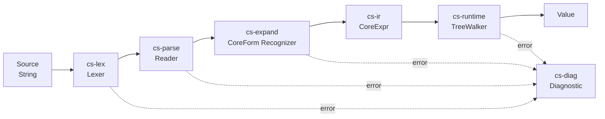

# Design Document — Foundation Milestone

## Overview

The Foundation milestone takes CrabScheme from an empty workspace to an
end-to-end-working tree-walking Scheme interpreter with a CLI, REPL, and
conformance scoreboard. It establishes nine of the project's twelve crates and
fixes the public types that all later milestones (bytecode VM, JIT, GC, macro
expander) build on.

The design here is deliberately small. We ship the simplest representation that
covers Requirements 1–10, leaving headroom for later optimization without
committing to schemes (NaN-boxing, stackmaps, generational GC) that would
constrain experimentation in subsequent milestones.

## Steering Document Alignment

### Technical Standards (tech.md)

- **Rust 2024**, MSRV pinned, workspace-unified dependencies.
- **Crate naming** `cs-<purpose>` per the conventions in structure.md.
- **Diagnostics** rendered through `cs-diag`, which wraps `miette` (final choice
  TBD per ADR-0002 in implementation; the abstraction over the renderer is the
  load-bearing part).
- **Lexer** built with `logos` per tech.md decision 6.
- **Reader** hand-rolled recursive descent, also per decision 6.
- **GC strategy** for foundation: `Rc<Cell<…>>`-based reference counting, with
  Bacon–Rajan-style cycle detection added when needed (R6RS allows cyclic
  structures via `set-car!` / `set-cdr!`). The tracing collector is M5; this
  spec does not introduce stackmaps or roots tracking yet.
- **No `unsafe`** in any foundation crate; the only place we'd want it (NaN-boxed
  `Value`) is deferred until the bytecode VM milestone.

### Project Structure (structure.md)

This spec creates exactly the following crates from the structure plan:

```
cs-core   ← Value, Symbol, Number, ports
cs-diag   ← spans, diagnostics, structured errors
cs-lex    ← Token, lexer
cs-parse  ← Datum, reader
cs-expand ← stub: core-form recognizer (no syntax-rules yet)
cs-ir     ← stub: CoreExpr (post-recognition AST)
cs-runtime← Runtime, Env, eval, builtins
cs-cli    ← `crabscheme` binary
cs-repl   ← REPL implementation
cs-test   ← conformance harness scaffolding
```

The bytecode (`cs-vm`), JIT (`cs-jit*`), AOT (`cs-aot`), and full stdlib
(`cs-stdlib`) crates are **created but empty** with placeholder `lib.rs` files,
so the workspace dependency graph is correct from day one.

## Code Reuse Analysis

CrabScheme is a greenfield project, so there is no existing internal code to
reuse. The "reuse" lens at this phase is about leveraging well-tested **external
crates** instead of writing equivalents.

### External Crates Leveraged

- **`logos`**: tokenizer macro, mature, fast. Saves ~1,000 LOC of hand-rolled
  lexer state machine.
- **`rug`** (or `num-bigint` + `num-rational`): arbitrary-precision integers and
  rationals. We pick one in ADR-0003. `rug` wraps GMP/MPFR (faster, license is
  LGPL — affects distribution); `num-bigint` is pure Rust (slower but
  permissively licensed). For foundation, **`num-bigint` + `num-rational`** to
  keep the binary self-contained and license simple; revisit at M8.
- **`miette`**: rustc-style diagnostic rendering. Used inside `cs-diag` so a
  later swap (e.g. to `ariadne`) is local.
- **`rustyline`**: REPL line editor with history, completion hooks, multi-line
  support.
- **`clap`** (derive): CLI parsing.
- **`unicode-normalization`**: NFC normalization for symbols per R6RS §4.2.4.
- **`unicode-segmentation`**: grapheme-cluster string operations.
- **`tracing`** + **`tracing-subscriber`**: structured tracing for `--trace`.
- **`insta`**: snapshot tests for the lexer, reader, and pretty-printer.
- **`proptest`**: property tests for numeric and list operations.
- **`anyhow`** + **`thiserror`**: at the binary boundary only; library crates
  use bespoke error enums.

### Integration Points

None at this milestone — CrabScheme has no external services, no databases, no
network. Foundation is fully self-contained.

## Architecture

The foundation pipeline is a five-stage pure-functional pipeline followed by a
side-effecting runtime:



The lexer, reader, recognizer, and IR lowering are pure functions on owned input.
The runtime owns mutable state (top-level env, GC roots, ports). This separation
makes property-based testing trivial: feed random datums to the pipeline up
through IR and the equality-of-output property proves no information loss.

### Modular Design Principles

- **Single File Responsibility**: e.g. `cs-lex/src/lexer.rs` contains only the
  lexer; `cs-lex/src/token.rs` contains only the token enum. Tests live in their
  respective files.
- **Component Isolation**: each crate compiles standalone. `cs-runtime` does
  not `use cs_lex::Token` — it accepts already-parsed `Datum` or `CoreExpr`.
- **Service Layer Separation**: `cs-runtime` separates the **evaluator** (pure
  reduction over `CoreExpr`) from the **builtins module** (Rust impls of R6RS
  procedures) from the **environment** (binding lookup).
- **Utility Modularity**: arithmetic helpers live in `cs-core::number`;
  string/character helpers in `cs-core::text`; both are independently testable.

## Components and Interfaces

### `cs-core`

- **Purpose:** define the universal value type (`Value`), the symbol interner
  (per-`Runtime`), the numeric tower types (`Number` / `Fixnum` / `Flonum` /
  `BigInt` / `Rational`), and the abstract port type. Owns no I/O.
- **Public surface:**
  ```rust
  pub enum Value { /* see Data Models */ }
  pub struct Symbol(/* opaque, interned */);
  pub struct SymbolTable { /* per-Runtime */ }
  pub enum Number { Fixnum(i64), Big(BigInt), Rat(Rational), Flonum(f64) }
  pub trait Port { fn read_char(&mut self) -> Result<Option<char>, IoError>; … }
  ```
- **Dependencies:** `num-bigint`, `num-rational`, `unicode-normalization`,
  `cs-diag` (for error spans on numeric parse).
- **Reuses:** none (foundational crate).

### `cs-diag`

- **Purpose:** define `Span`, `FileId`, `SourceMap`, and the `Diagnostic` type
  used by every other crate. Render diagnostics to ANSI text or plain text.
- **Public surface:**
  ```rust
  pub struct FileId(pub u32);
  pub struct Span { pub file: FileId, pub start: u32, pub end: u32 }
  pub struct SourceMap { /* file_id → contents */ }
  pub struct Diagnostic { severity, code, message, primary: Span, labels, notes }
  pub fn render(diag: &Diagnostic, sm: &SourceMap, color: ColorMode) -> String;
  ```
- **Dependencies:** `miette` (rendering only — `Diagnostic` itself is bespoke
  so we can swap renderers).
- **Reuses:** none.

### `cs-lex`

- **Purpose:** transform a source string into a stream of `Token` values with
  spans. Recognizes all R6RS lexical syntax §4.2.
- **Public surface:**
  ```rust
  pub enum Token<'src> { LParen, RParen, LBracket, RBracket,
                         Quote, QuasiQuote, Unquote, UnquoteSplicing,
                         Dot, HashLParen /* #( */, HashVu8 /* #vu8( */,
                         HashSemicolon /* #; */, HashTrueFalse(bool),
                         Number(NumLit<'src>), String(StrLit<'src>),
                         Character(char), Identifier(&'src str),
                         BlockComment, LineComment, Whitespace, Eof }
  pub struct Lexer<'src> { /* iterator over (Token, Span) */ }
  pub fn lex(file: FileId, src: &str) -> Lexer<'_>;
  ```
- **Dependencies:** `logos`, `cs-diag`.
- **Reuses:** none.

### `cs-parse`

- **Purpose:** consume a `Lexer` and produce a `Datum` tree per R6RS §4.3
  (read-syntax). Pure recursive-descent.
- **Public surface:**
  ```rust
  pub enum Datum {
      Boolean(bool, Span),
      Number(Number, Span),
      Character(char, Span),
      String(Rc<str>, Span),
      Symbol(Symbol, Span),
      Pair(Rc<Datum>, Rc<Datum>, Span),
      Null(Span),
      Vector(Vec<Datum>, Span),
      ByteVector(Vec<u8>, Span),
      // Reader-syntax expansions retained for round-trip:
      Quote(Rc<Datum>, Span), QuasiQuote(…), Unquote(…), UnquoteSplicing(…),
  }
  pub fn read_one(lexer: &mut Lexer, syms: &mut SymbolTable) -> Result<Option<Datum>, ReaderError>;
  pub fn read_all(lexer: &mut Lexer, syms: &mut SymbolTable) -> Result<Vec<Datum>, Vec<ReaderError>>;
  ```
- **Dependencies:** `cs-core`, `cs-lex`, `cs-diag`.
- **Reuses:** `cs-lex::Lexer` directly.

### `cs-expand`

- **Purpose:** at foundation, this is a **core-form recognizer** — not yet a
  hygienic macro expander. It walks `Datum` trees, identifies the R6RS core
  forms listed in Requirement 5, and produces `CoreExpr` (defined in `cs-ir`).
  The full hygienic expander lands in a later spec. The crate exists now so
  callers depend on the right layer from day one.
- **Public surface:**
  ```rust
  pub struct Expander<'rt> { /* holds reference to Runtime symbols */ }
  pub fn expand(d: &Datum, exp: &mut Expander) -> Result<CoreExpr, ExpandError>;
  pub fn expand_program(prog: &[Datum], exp: &mut Expander) -> Result<Vec<CoreExpr>, Vec<ExpandError>>;
  ```
- **Dependencies:** `cs-core`, `cs-parse`, `cs-ir`, `cs-diag`.
- **Reuses:** `Datum` from `cs-parse`.

### `cs-ir`

- **Purpose:** define `CoreExpr`, the post-expansion AST consumed by every
  execution tier. At foundation, only the tree-walker consumes it; later the
  bytecode VM and JIT will consume the same type.
- **Public surface:**
  ```rust
  pub enum CoreExpr {
      Const(Value, Span),
      Ref { var: VarId, span: Span },
      Set { var: VarId, value: Box<CoreExpr>, span: Span },
      Lambda { params: Params, body: Box<CoreExpr>, span: Span },
      App { func: Box<CoreExpr>, args: Vec<CoreExpr>, span: Span },
      If { cond: Box<CoreExpr>, then: Box<CoreExpr>, alt: Box<CoreExpr>, span: Span },
      Begin { exprs: Vec<CoreExpr>, span: Span },
      Letrec { bindings: Vec<(VarId, CoreExpr)>, body: Box<CoreExpr>, span: Span },
  }
  pub struct VarId(pub u32);    // resolved binding identity
  pub enum Params { Fixed(Vec<VarId>), Variadic { fixed: Vec<VarId>, rest: VarId } }
  ```
  Note: `let`, `let*`, `cond`, `case`, `and`, `or`, `when`, `unless` desugar to
  the above six forms in `cs-expand`.
- **Dependencies:** `cs-core`, `cs-diag`.
- **Reuses:** `Value` from `cs-core`.

### `cs-runtime`

- **Purpose:** the heart of foundation. Owns the top-level environment, the
  symbol table, the source map, the port table, and the tree-walking evaluator.
- **Public surface:**
  ```rust
  pub struct Runtime { /* opaque */ }
  impl Runtime {
      pub fn new() -> Self;
      pub fn eval_str(&mut self, src: &str, name: &str) -> Result<Value, Diagnostic>;
      pub fn eval_expr(&mut self, e: &CoreExpr) -> Result<Value, Condition>;
      pub fn define(&mut self, name: &str, value: Value);
      pub fn get(&self, name: &str) -> Option<Value>;
  }
  ```
- **Dependencies:** all of the above.
- **Reuses:** `Value`, `CoreExpr`, `Datum`, `Lexer`.
- **Internal modules:**
  - `env.rs` — lexical environment with parent chain
  - `eval.rs` — `eval(env, expr) -> Result<Value, Condition>` recursion
  - `tail.rs` — tail-call trampoline
  - `builtins/` — one file per category (arith, list, string, char, io, control)
  - `condition.rs` — R6RS conditions (& predicates, & error, & assertion, etc.)
  - `port.rs` — concrete port impls (file, string, stdin/stdout/stderr)

### `cs-cli`

- **Purpose:** the `crabscheme` binary. Argument parsing, subcommand dispatch,
  exit-code mapping.
- **Public surface:** `fn main()` only.
- **Dependencies:** `cs-runtime`, `cs-repl`, `cs-diag`, `clap`, `tracing-subscriber`.
- **Reuses:** all upstream.

### `cs-repl`

- **Purpose:** REPL state machine, multi-line input detection, history file
  management, prompt formatting.
- **Public surface:**
  ```rust
  pub struct Repl { /* … */ }
  impl Repl {
      pub fn new(rt: Runtime, opts: ReplOpts) -> Self;
      pub fn run(self) -> Result<(), Diagnostic>;
  }
  ```
- **Dependencies:** `cs-runtime`, `rustyline`, `cs-diag`.

### `cs-test`

- **Purpose:** conformance harness scaffolding. At foundation, it loads a
  curated test corpus from `tests/conformance/foundation/`, runs each in an
  isolated `Runtime`, and reports pass/fail/skip.
- **Public surface:** `fn main()` only (run as `cargo xtask conformance`).
- **Dependencies:** `cs-runtime`.

## Data Models

### Value

```rust
// cs-core/src/value.rs
//
// Foundation uses a tagged enum, NOT NaN-boxing. NaN-boxing lands at M4.
pub enum Value {
    // Immediate / inline (no heap):
    Null,
    Unspecified,
    Eof,
    Boolean(bool),
    Character(char),
    Fixnum(i64),
    Flonum(f64),

    // Heap-allocated (Rc for now; Gc<T> at M5):
    BigInt(Rc<BigInt>),
    Rational(Rc<Rational>),
    String(Rc<RefCell<String>>),       // mutable per R6RS
    Symbol(Symbol),                     // copy-cheap, points into per-Runtime SymbolTable
    Pair(Rc<RefCell<Pair>>),
    Vector(Rc<RefCell<Vec<Value>>>),
    ByteVector(Rc<RefCell<Vec<u8>>>),
    Procedure(Rc<Procedure>),
    Port(Rc<RefCell<dyn Port>>),
    Condition(Rc<Condition>),
}

pub struct Pair { pub car: Value, pub cdr: Value }

pub enum Procedure {
    Builtin { name: &'static str, arity: Arity, f: fn(&mut Runtime, &[Value]) -> EvalResult },
    Closure { params: Params, body: Rc<CoreExpr>, env: Rc<Env>, name: Option<Symbol> },
}
```

**Equality rules** are implemented as standalone functions `eq`, `eqv`, `equal`
in `cs-core::eq`. `equal?` uses Bacon's algorithm (interleaved with cycle
detection via a small bound + slow path with a hash set) to terminate on cyclic
structures.

### Diagnostic

```rust
pub struct Diagnostic {
    pub severity: Severity,           // Error | Warning | Note | Help
    pub code: Option<&'static str>,   // e.g. "E0042"
    pub message: String,
    pub primary: Span,
    pub labels: Vec<(Span, String)>,
    pub notes: Vec<String>,
}
```

### CoreExpr

See `cs-ir` public surface above.

### Token

See `cs-lex` public surface above.

### Datum

See `cs-parse` public surface above.

## Error Handling

CrabScheme distinguishes three error categories, each with a distinct type:

1. **`ReaderError`** (`cs-parse`): syntactically invalid source. Always carries
   a span. Multiple per parse permitted.
2. **`ExpandError`** (`cs-expand`): well-formed datum that violates core-form
   syntax (e.g. `(if 1)` — too few branches). Always carries a span.
3. **`Condition`** (`cs-runtime`): R6RS-defined conditions raised at evaluation
   time. Hierarchical (`&condition` ← `&error` ← `&assertion` etc.), introspectable
   from Scheme.

The CLI/REPL boundary converts the first two into `Diagnostic` for rendering
and lets conditions propagate to a top-level handler that formats them similarly.

### Error Scenarios

1. **Scenario:** Source file has an unbalanced paren.
   - **Handling:** lexer produces tokens; reader tracks depth; on EOF with
     non-zero depth, emit `ReaderError::Unbalanced { open: Span }` pointing at
     the unclosed `(`. Recovery: report and continue to next top-level form.
   - **User Impact:** rustc-style diagnostic with caret on the unclosed paren and
     a note explaining what was expected.

2. **Scenario:** Programmer writes `(undefined-fn 1 2)`.
   - **Handling:** evaluator looks up `undefined-fn`, finds no binding, raises
     `&undefined` condition with the variable name and span.
   - **User Impact:** error message with the call-site span and the undefined
     identifier highlighted.

3. **Scenario:** Programmer writes `(+ 1 "two")`.
   - **Handling:** `+` builtin checks operand types, raises `&assertion` with
     `who: '+`, `irritants: ("two")`, span of the offending argument.
   - **User Impact:** error showing the call site, with the bad argument
     underlined and the message naming `+` and saying `expected number, got string`.

4. **Scenario:** Programmer writes `(let ((x 1)) (set! x (+ x 1)) x)` and the
   binding is mutated correctly — no error, but reference cycles are possible
   via `set-car!` on a self-referential pair.
   - **Handling:** `Rc<RefCell<Pair>>` allows cycles. `equal?` handles cycles
     via path-tracking. A simple Bacon–Rajan cycle collector is added to
     `cs-runtime` if leak tests show RSS growth in long-running REPL sessions;
     otherwise deferred to the M5 GC milestone.
   - **User Impact:** none in correctness; potential memory pressure in
     pathological programs, addressed in M5.

5. **Scenario:** REPL receives `(define (f x) (+ x` (incomplete).
   - **Handling:** lexer reports OK so far; reader returns `Incomplete` after
     seeing EOF mid-form. REPL catches `Incomplete`, switches to continuation
     prompt, accumulates more input, retries.
   - **User Impact:** prompt changes from `>` to `…`, no error shown.

6. **Scenario:** Stack overflow in tree-walker on deep non-tail recursion.
   - **Handling:** the tree-walker uses a heap-allocated continuation stack
     (`Vec<Frame>`) instead of the host stack precisely so this *cannot*
     overflow — instead we get an OOM-bounded `&error` if the heap stack
     exceeds a configurable limit (default 1M frames).
   - **User Impact:** structured Scheme error, never a segfault.

## Testing Strategy

### Unit Testing

Each crate has tests for its public API and the load-bearing private functions:

- **`cs-core`**: `Value` constructors, equality (`eq?`, `eqv?`, `equal?` —
  including cyclic), symbol interning, numeric tower operations and contagion.
- **`cs-lex`**: every R6RS token shape with valid + invalid examples.
  Snapshot-tested with `insta`.
- **`cs-parse`**: every datum shape; round-trip property test
  `parse(print(d)) == d` for arbitrary datums (proptest).
- **`cs-expand`**: each core form including degenerate cases (empty body,
  trailing dot, etc.).
- **`cs-runtime/eval`**: each `CoreExpr` variant individually, plus integration
  tests for builtins.
- **`cs-runtime/builtins`**: per-builtin tests including R6RS-prescribed edge
  cases (e.g. `(remainder -13 4)` per §11.7.3).

### Integration Testing

Workspace-level tests under `tests/`:

- **`tests/conformance/foundation/`**: ≥ 100 R6RS-suite-derived tests targeting
  §11.5, 11.7, 11.8, 11.9, 11.10, 11.11, 11.12, 11.16. Run via `cargo xtask
  conformance`.
- **`tests/golden/`**: snapshot tests for `crabscheme run example.scm` outputs.
- **`tests/cli/`**: blackbox CLI tests using `assert_cmd` — `--help`, `--version`,
  exit codes, stderr formatting.
- **`tests/repl/`**: PTY-driven REPL tests using `expectrl` — verify line
  editing, multi-line input, history, Ctrl-C, Ctrl-D behaviors.

### End-to-End Testing

User-scenario tests verifying full flows:

- **Scenario A**: write `factorial.scm`, run via CLI, get expected output.
- **Scenario B**: launch REPL, define a function, call it, inspect history
  recall.
- **Scenario C**: feed malformed source to CLI, verify exit code and stderr
  diagnostic format.
- **Scenario D**: `crabscheme -e 'pipeline | composition'` round-trip in shell.

### Differential Testing (Foundation Variant)

At foundation we have only one execution tier (the tree-walker) so there is
nothing to differentially compare *across tiers* yet. The differential layer is
nonetheless **scaffolded** in `cs-test` so it accepts a corpus of expressions
and runs each under a configurable set of backends. Initially the only backend
is the tree-walker; the bytecode VM and JIT plug in at later milestones,
inheriting the same corpus and reusing the same comparison logic. The harness
flags any divergence as a regression.

### Property Testing

`proptest` strategies for:
- arbitrary `Number` values: round-trip through `read` and `write`.
- arbitrary `Datum` trees (bounded depth): `read(write(d)) == d`.
- arbitrary list operations: `(length (append a b)) == (+ (length a) (length b))`.
- arbitrary string operations: equivalence between `(string->list)` /
  `(list->string)`.
- arbitrary numeric expressions: result tag matches R6RS contagion table.

Run for ≥ 10,000 cases in CI per release-blocking property.

### Fuzzing

`cargo-fuzz` targets, run nightly:
- `fuzz_lex`: random bytes → must not panic.
- `fuzz_read`: random ASCII → must not panic.
- `fuzz_eval`: lex+read+eval random small programs (heuristically constructed)
  → must not panic.
