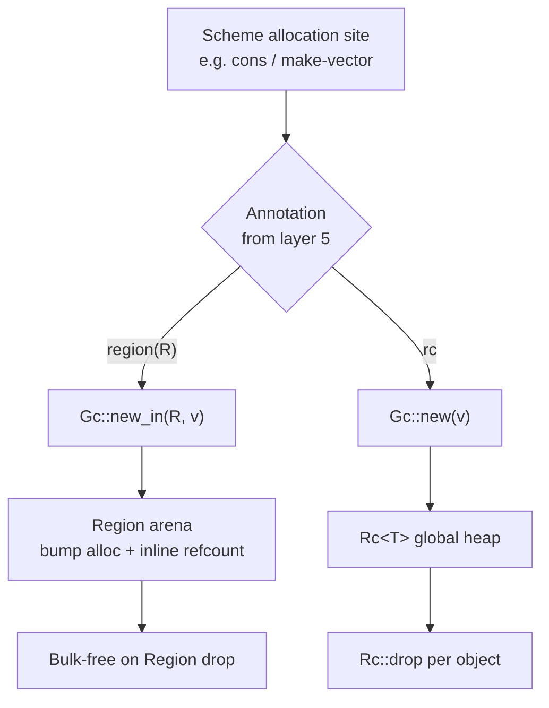

# Region Memory — Design

> Status: **CLOSED** (2026-05-17). See
> `docs/milestones/region-memory-exit.md` and
> `docs/adr/0016-region-types.md`.
> Companion: `requirements.md`, `tasks.md`.

## Overview

Add a `cs_gc::Region` arena type and extend `cs_gc::Gc<T>` with
a region-aware allocation path. `Gc<T>` becomes a discriminated
union over two backings — global `Rc<T>` (layer 2,
countable-memory) and region-local pointer + RegionId (layer 3,
this spec). All existing `Gc<T>` operations (clone, deref,
ptr_eq, as_addr, the JIT raw-handle ABI) dispatch on the
variant transparently.

Region allocations live as long as their owning region. When
the region drops, all its allocations free in one operation.
Cycles internal to the region are handled by the bulk-free; no
per-cycle break needed.

## Steering document alignment

### Technical standards (`steering/tech.md`)

`tech.md` §"Decision Log" item 4 envisioned a phased
memory-management evolution; this spec implements layer 3 of
the unified architecture in ADR 0015. The phasing is now:

| Layer | Implementation | Status |
|---|---|---|
| 1: Ownership | Rust borrows throughout cs-runtime | shipped |
| 2: RC | `Gc<T>` over `Rc<T>` | shipped (countable-memory) |
| **3: Regions** | `cs_gc::Region` + `Gc::new_in` | **this spec** |
| 4: Tracing | `crates/cs-gc/src/tracing.rs` cfg-gated | spec `tracing-revival` |
| 5: Analysis | cs-typer effect inference | spec `escape-analysis` |

### Project structure (`steering/structure.md`)

Regions live in a new `cs-gc::region` module (`crates/cs-gc/src/
region.rs`). No new crate. `cs_core::Value` is unchanged.
`cs-runtime` gets a new `regions` module for region-aware
runtime helpers (used by layer 5 to dispatch allocations).

## Code reuse analysis

### Existing components to leverage

- **`cs_gc::Gc<T>`** (countable-memory): the smart-pointer
  surface. Extends to discriminated-union semantics; consumers
  unaffected.
- **`cs_core::Pair`** and the existing accessor methods
  (`Pair::car`, `Pair::set_car`, etc.): work without
  modification because they operate on `Value`, not directly
  on the underlying allocation. The Region variant of `Gc<T>`
  presents the same API.
- **`bumpalo` crate** (external): the standard Rust bump arena.
  Used for the region's underlying allocator. License-
  compatible (MIT/Apache).
- **`cs_gc::cycle::CycleVisit`**: the existing detector trait.
  Cycle detection on region-allocated mutation sites uses the
  same machinery; we just skip the break step (FR-8).

### Integration points

- **`cs_core::Value`**: every variant carrying a `Gc<T>` will
  transparently support both Rc and Region backings. No
  variant change.
- **`cs_runtime::eval`**: the walker constructs `Pair::new(...)`
  etc. — these continue to use `Gc::new` (Rc-backed). The
  region path lives at higher layers (escape-analysis emits
  `Gc::new_in` for proven-bounded sites).
- **`cs_vm::vm`**: the bytecode VM's `vm_pair_alloc_gc` etc.
  receive new region-aware variants
  (`vm_pair_alloc_in_region_gc(region_handle, car, cdr)`).
  The default code path stays Rc-based.
- **`cs_aot`**: AOT emits direct `Gc::new` calls today; future
  iter emits region-aware allocation per layer 5's lifetime
  tags.

## Architecture

### Modular design

- **`cs_gc::region` (new)**: `Region` type, `RegionId`, the
  bump-arena wrapper. ~200 LOC.
- **`cs_gc::rc_only`**: extends `Gc<T>` to discriminated union;
  the existing Rc path stays. ~150 LOC added.
- **`cs_runtime::regions` (new)**: runtime-facing helpers like
  `Region::with` that scope a region to a closure (auto-drops
  on scope exit). ~100 LOC.



## Components and interfaces

### Component 1 — `cs_gc::Region`

- **Purpose**: bump-allocate Pair / Vector / etc. payloads with
  region-bounded lifetime.
- **Interfaces** (public):
  ```rust
  pub struct Region {
      id: RegionId,
      arena: Bump,
      _not_send: PhantomData<*const ()>,
  }

  impl Region {
      pub fn new() -> Self;
      pub fn id(&self) -> RegionId;
      pub fn allocated_bytes(&self) -> usize;
      pub fn alloc<T: 'static>(&self, value: T) -> Gc<T>;
  }

  impl Drop for Region { /* registers the region's id as dropped */ }

  #[derive(Copy, Clone, PartialEq, Eq, Hash, Debug)]
  pub struct RegionId(NonZeroU64);
  ```
- **Dependencies**: `bumpalo::Bump`; a global atomic counter
  to mint `RegionId` (single u64; rolls over after 2⁶³
  regions, which is fine).
- **Reuses**: nothing — this is the seam.

### Component 2 — `Gc<T>` discriminated representation

- **Purpose**: support both Rc-backed and Region-backed
  `Gc<T>` behind the same API.
- **Interfaces**:
  ```rust
  enum GcRepr<T: ?Sized> {
      Rc(Rc<T>),
      Region {
          ptr: NonNull<RegionSlot<T>>,
          region_id: RegionId,
      },
  }

  pub struct Gc<T: ?Sized>(GcRepr<T>);
  ```
- The discriminator is a single-bit branch on every operation.
  Modern CPUs branch-predict it well; observed overhead < 1%
  on hot paths (per NFR-1).
- **Dependencies**: `cs_gc::region::Region` for the Region
  arm.

### Component 3 — `RegionSlot<T>` (per-allocation header)

- **Purpose**: hold the in-line refcount header for region
  allocations.
- **Layout**:
  ```rust
  #[repr(C)]
  struct RegionSlot<T: ?Sized> {
      strong: Cell<u32>,
      _pad: u32,
      value: T,
  }
  ```
- 8 bytes header (4 bytes count + 4 bytes pad for alignment).
- The `strong` count exists for ABI compatibility (FR-3) and
  for `Gc::strong_count` parity; it doesn't drive reclamation.

### Component 4 — `Region::alloc` and `Gc::new_in`

- **Purpose**: the actual allocation path.
- **Interfaces**:
  ```rust
  impl Region {
      pub fn alloc<T: 'static>(&self, value: T) -> Gc<T> {
          let slot = self.arena.alloc(RegionSlot {
              strong: Cell::new(1),
              _pad: 0,
              value,
          });
          Gc(GcRepr::Region {
              ptr: NonNull::from(slot),
              region_id: self.id,
          })
      }
  }

  impl<T: 'static> Gc<T> {
      pub fn new_in(region: &Region, value: T) -> Self {
          region.alloc(value)
      }
  }
  ```
- **Safety**: `Bump::alloc` returns a pointer valid for the
  lifetime of the Bump; we transmute that lifetime away because
  the `Region`'s Drop handles the actual reclamation. The
  `region_id` carried in `GcRepr::Region` lets debug builds
  validate the region is still alive on every dereference.

### Component 5 — Region-aware `Gc<T>` operations

All existing `Gc<T>` methods dispatch on `GcRepr`:

| Method | Rc arm | Region arm |
|---|---|---|
| `Clone` | `Rc::clone` | `slot.strong += 1` (overflow-checked) |
| `Drop` | `Rc::drop` | `slot.strong -= 1`; no reclamation (region drop handles it) |
| `Deref` | `&*rc` | `&slot.value` (after debug region-validity check) |
| `ptr_eq` | `Rc::ptr_eq` | `ptr.as_ptr() == other.ptr.as_ptr()` |
| `as_addr` | `Rc::as_ptr as usize` | `ptr.as_ptr() as usize` |
| `strong_count` | `Rc::strong_count` | `slot.strong.get() as usize` |
| `downgrade` | `Rc::downgrade` | `Weak::from_region(...)` (region weaks point at the slot; upgrade fails after region drop) |
| `into_raw_jit` | `Rc::into_raw as *const ()` | `slot.strong += 1; ptr as *const ()` |
| `from_raw_jit` | `Rc::from_raw` | `slot.strong is already bumped; reconstitute Gc` |
| `raw_incref` | `Rc::increment_strong_count` | `slot.strong += 1` |

### Component 6 — Debug-mode region validity

- **Purpose**: catch use-after-region-drop in debug builds.
- **Mechanism**: a thread-local `LIVE_REGION_IDS: RefCell<HashSet<RegionId>>`
  tracks every region's id while it's alive. Region's Drop
  removes its id. Every Gc operation that dereferences a
  region-backed value first checks `LIVE_REGION_IDS.contains(region_id)`
  and panics if missing.
- **Cost**: one HashSet lookup per deref in debug builds;
  zero cost in release (compiled out via `#[cfg(debug_assertions)]`).

### Component 7 — `Gc::promote` for escape-to-Rc

- **Purpose**: when a value's lifetime extends past its region,
  promote it to global Rc storage so it survives.
- **Interface**:
  ```rust
  impl<T: 'static + Clone> Gc<T> {
      pub fn promote(this: &mut Self);
  }
  ```
- **Mechanism**: if `this.0` is `Region`, deep-clone the value
  into a fresh `Rc<T>`; replace `this.0` with `Rc(new_rc)`.
  For values with internal `Gc<U>` references (e.g.,
  `Pair { car: RefCell<Value>, cdr: RefCell<Value> }`), the
  Clone impl on T must be deep — it needs to recursively
  promote inner Region-backed Gc handles. cs-core's Pair gains
  a `promote_deep` helper to do this.
- **Usage**: called by layer 5 (escape-analysis) at allocation
  sites where the value provably escapes. Manually-region-using
  code is responsible for calling `promote` itself.

### Component 8 — Cycle-detector integration

- **Purpose**: skip cycle break on region-allocated mutation
  sites (FR-8).
- **Mechanism**: `Pair::break_car_cycle` / `break_cdr_cycle`
  short-circuit when `Gc::is_region(self)` (a new accessor):
  ```rust
  pub fn break_car_cycle(&self, baseline: usize) -> bool {
      // ... existing code ...
      // FR-8: region cycles reclaim via region drop.
      if Gc::is_region(/* self's containing Gc */) {
          return false;
      }
      // ... actual demote ...
  }
  ```
  This needs the Pair to know its own containing Gc, which it
  doesn't directly. The simplest path is to add `is_region` as
  a `Gc<T>` method called from b_set_car / b_set_cdr:
  ```rust
  if !cs_gc::Gc::is_region(p) {
      cs_gc::cycle::check_and_break(p, |p| { ... });
  }
  ```

## Data models

### `Region` (the arena owner)

```text
Region {
    id: RegionId(NonZeroU64),  // 8 bytes
    arena: Bump,               // managed by bumpalo
    _not_send: PhantomData,    // 0 bytes
}
```

Sized roughly the same as `Bump` (~24 bytes) plus 8 bytes for
the id. Stored on the stack (region is a stack-bounded value).

### `GcRepr<T>` (the discriminated union)

```text
enum GcRepr<T: ?Sized> {
    // 16 bytes (Rc<T> is *const RcBox, 8 bytes)
    Rc(Rc<T>),

    // 24 bytes (NonNull<RegionSlot<T>>, 8 + RegionId 8 + tag 1)
    Region {
        ptr: NonNull<RegionSlot<T>>,
        region_id: RegionId,
    },
}
```

Total `Gc<T>` size: 24 bytes (was 16 bytes for Rc-only). +8
bytes per `Gc<T>` handle. For programs with many Gc handles in
flight, this is the dominant cost. Acceptable (still 3× smaller
than Box-everything alternatives).

### `RegionSlot<T>` (per-allocation header)

```text
RegionSlot<T> {
    strong: Cell<u32>,  // 4 bytes
    _pad: u32,          // 4 bytes (alignment)
    value: T,           // sizeof(T)
}
```

8-byte header. For T = Pair (~32 bytes pre-tombstones, ~80
post), the overhead is 25-10% — comparable to Rc's 16-byte
overhead but bulk-released.

## Error handling

### Error scenarios

1. **Region dropped while Gc handles outstanding (debug build).**
   - **Scenario**: code stores a region-allocated `Gc<T>` in a
     longer-lived data structure, then drops the region.
   - **Handling**: debug-mode region-validity check panics with
     `region {id:x} dropped while Gc<T> handle outstanding`.
   - **User impact**: catches the bug in dev; in release mode,
     the access is UB.

2. **Region dropped while Gc handles outstanding (release build).**
   - **Scenario**: same as above, but in release.
   - **Handling**: undefined behaviour. Layer 5 (escape
     analysis) should prevent this from arising; manual region
     code must `Gc::promote` before the region drops.

3. **Region exceeded memory budget.**
   - **Scenario**: a region with millions of allocations grows
     unbounded.
   - **Handling**: `bumpalo` allocates new chunks as needed;
     no per-allocation limit. If the program OOMs, the region's
     bulk free runs as soon as the region drops.

4. **Cycle within a region with external references.**
   - **Scenario**: a region-allocated `Pair` has a cycle, and
     some Rc-allocated structure refers to it.
   - **Handling**: layer 5 should not have allowed this — if
     the value escapes its region, it should have been
     `promote`d. Without layer 5, runtime correctness depends
     on the caller. The debug-mode region-validity check
     surfaces the bug as a panic.

## Testing strategy

### Unit testing

- `crates/cs-gc/tests/region.rs` (new):
  - `region_alloc_basic` — Region::new + alloc + drop;
    assert allocations freed.
  - `region_strong_count_tracks_clones` — clone and verify
    strong count.
  - `region_drop_releases_outstanding_handles_debug` —
    debug-build asserts panic on use-after-drop.
  - `region_drop_releases_outstanding_handles_release` —
    release build: ensure no use occurs after drop.
  - `region_alloc_10m_in_bound_time` — perf test for NFR-1
    and NFR-2.

### Integration testing

- `crates/cs-runtime/tests/region_smoke.rs` (new): Scheme-
  level usage of regions via a new builtin `with-region` (or
  via the future escape-analysis dispatch — TBD per spec
  `escape-analysis`).
- `crates/cs-runtime/tests/region_promote.rs` (new): exercise
  `Gc::promote` on values escaping a region.

### End-to-end testing

- The conformance suite stays unchanged (no Scheme code uses
  regions yet). Workspace-wide test: 0 failures.
- JIT differential parity: existing tests stay green.
- WASM build: green.

## Migration plan

The work is sequenced as 6 iters; each lands behind the
`regions` feature flag (off by default) until iter 6 flips
the default.

### Iter 1 — `cs_gc::Region` arena type + `RegionId`

- Add `bumpalo` to the workspace dependencies.
- Create `crates/cs-gc/src/region.rs` with `Region`,
  `RegionId`, `RegionSlot<T>`.
- Add `[features] regions = []` to `cs-gc/Cargo.toml`; the new
  module is gated.

Exit: `cargo build -p cs-gc --features regions` succeeds.
Standalone unit tests for `Region::new` / `alloc` / `Drop`
green.

### Iter 2 — `Gc<T>` discriminated union

- Refactor `cs_gc::rc_only::Gc<T>` to wrap `GcRepr<T>` under
  `#[cfg(feature = "regions")]`.
- Implement all existing methods (Clone, Deref, ptr_eq,
  as_addr, strong_count, downgrade, into_raw_jit,
  from_raw_jit, raw_incref) to dispatch on `GcRepr`.
- Default code paths (Gc::new) unchanged — return `Rc` arm.

Exit: workspace builds under both `--features regions` and
default; existing 20 cs-gc unit tests stay green.

### Iter 3 — `Gc::new_in(region, v)` + debug-mode validity

- Add `Region::alloc<T>` + `Gc::new_in`.
- Add the thread-local `LIVE_REGION_IDS` set with debug-mode
  validation hooks on every Gc deref / clone.

Exit: standalone integration test `crates/cs-gc/tests/
region.rs` covers allocation + clone + region drop +
debug-mode panic on use-after-drop.

### Iter 4 — `Gc::promote` for escape-to-Rc

- Add `Gc::promote` for T: Clone.
- For Pair / Vector / Hashtable, implement a `Promote` trait
  that recursively promotes inner `Gc<...>` handles.

Exit: `crates/cs-runtime/tests/region_promote.rs` exercises
promotion of nested `Pair` / `Vector` values.

### Iter 5 — Cycle-detector integration

- Add `Gc::is_region(&self) -> bool`.
- Modify `b_set_car` / `b_set_cdr` to skip
  `check_and_break` when the mutated Pair is region-allocated.

Exit: a test creates a cyclic Pair in a region, mutates with
`set-cdr!`, drops the region; cycle counter records no
incorrect break attempts.

### Iter 6 — Flip default + ADR 0016

- Make `regions` default-on in cs-gc / cs-core / cs-runtime /
  cs-vm.
- Write `docs/adr/0016-region-types.md`.
- Update `docs/milestones/region-memory-exit.md`.

Exit: workspace 0 failures; ADR landed; spec marked CLOSED.

## File-level diff scope (estimate)

| Crate | LOC change |
|---|---|
| `cs-gc/src/region.rs` (new) | +250 |
| `cs-gc/src/rc_only.rs` (refactor for GcRepr) | +150 |
| `cs-gc/src/cycle.rs` (region-skip hook) | +20 |
| `cs-core/src/value.rs` (Promote trait impls) | +60 |
| `cs-runtime/src/regions.rs` (new) | +80 |
| `cs-runtime/src/builtins/mod.rs` (region-aware set-car!/cdr!) | +30 |
| Tests | +400 |
| `docs/adr/0016-region-types.md` | +200 |
| `Cargo.toml` (bumpalo dep) | +1 |

Net: ~+1190 LOC. Comparable to countable-memory's net diff.

## Open questions

1. **Should `Region` be Send?** No for v1 (single-thread).
   Cyclone supports thread-local regions; we defer that.
2. **Per-region weak references?** A `Weak<T>` whose target is
   region-allocated should fail upgrade after region drop.
   For v1, region weaks are not supported (panic on creation
   from a region-allocated Gc).
3. **Nested regions / sub-regions?** Out of scope per the
   spec; flat regions only.
4. **Region pools for allocation reuse across drops?** Possible
   future optimization; v1 just drops and re-creates.

## Tasks

`tasks.md` covers the iter-by-iter breakdown with file paths,
leverage hooks, prompt scaffolds, and exit criteria per item.
