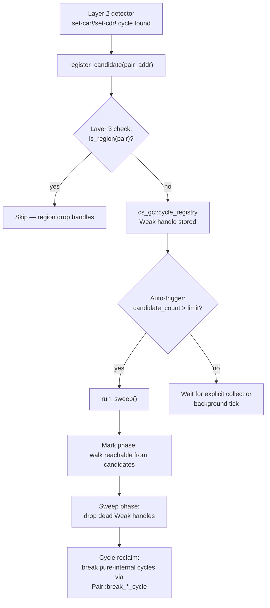

# Tracing Revival — Design

> Status: **Draft**.
> Companion: `requirements.md`, `tasks.md`.

## Overview

Re-expose the M5 tracing GC infrastructure (`crates/cs-gc/src/
tracing.rs`, currently cfg-gated as a rollback path) as an
opt-in `tracing-cycle-collector` feature. The reframed role:
operate as a periodic cleanup pass over the
**cycle-candidate set** populated by Layer 2's
synchronous detector — not as a whole-heap collector.

Add a new `cs_gc::cycle_registry` module that holds Weak
handles to allocations the detector flagged as participating
in a cycle. The sweep walks this small set (bounded by the
auto-trigger threshold), marks reachable, sweeps unmarked,
and breaks cycles whose only references are internal to the
candidate set.

Region-allocated (Layer 3) values are excluded — their
reclamation is guaranteed via region drop, no tracing needed.

## Steering document alignment

### Technical standards (`steering/tech.md`)

ADR 0006's M5 tracing GC was originally the whole-heap
collector. ADR 0014 (countable-memory) deprecated that role
in favor of RC. This spec — Layer 4 of ADR 0015's unified
architecture — repurposes the same code for a much narrower
role: residual cycle reclamation.

### Project structure (`steering/structure.md`)

- The existing `crates/cs-gc/src/tracing.rs` (~623 LOC) stays
  in place. Its `Trace` trait, `Heap`, `Marker` types are
  reused as the sweep backend.
- A new `crates/cs-gc/src/cycle_registry.rs` (~200 LOC)
  exposes the candidate-set API.
- `cs-runtime/src/countable_memory_cycle.rs` gains a
  `register_candidate` hook called from `b_set_car` /
  `b_set_cdr` on positive detection.

## Code reuse analysis

### Existing components to leverage

- **`crates/cs-gc/src/tracing.rs`** (M5): `Heap`, `Trace`,
  `Marker`, `add_root`, `collect`. Repurposed as the sweep
  backend.
- **`cs-runtime::countable_memory_cycle`** (countable-memory
  iter 7): the cycle-detection counter. Extended with
  `register_candidate`.
- **`cs_gc::cycle::CycleVisit`** (countable-memory iter 3):
  for tracing the candidate subgraph during the sweep.
- **Layer 2's `Pair::break_*_cycle`** (countable-memory iter
  7.1): the sweep can invoke these as the cycle-break
  mechanism when a pure-internal cycle is identified.
- **Layer 3's `Gc::is_region`** (region-memory spec): the
  filter that excludes region-allocated values from the
  registry.

### Integration points

- **`cs-runtime::Runtime`**: gains a
  `tracing_policy: TracingPolicy` field plus methods to
  configure it (set thresholds, opt into background tick).
- **`cs-runtime::builtins::b_collect`**: the existing
  `(collect)` builtin, which is a no-op under
  countable-memory, now runs `run_sweep()` when
  `tracing-cycle-collector` is on.

## Architecture



## Components and interfaces

### Component 1 — `cs_gc::cycle_registry`

- **Purpose**: hold Weak handles to cycle-candidate
  allocations.
- **Interfaces** (in `crates/cs-gc/src/cycle_registry.rs`):
  ```rust
  thread_local! {
      static REGISTRY: RefCell<HashMap<usize, Box<dyn AnyWeak>>> =
          RefCell::new(HashMap::new());
      static AUTO_TRIGGER_THRESHOLD: Cell<usize> = Cell::new(10_000);
  }

  pub trait AnyWeak {
      fn upgrade_addr(&self) -> Option<usize>;
      fn trace(&self, marker: &mut Marker);
  }

  pub fn register_cycle_candidate<T: 'static + CycleVisit>(
      addr: usize,
      weak: cs_gc::Weak<T>,
  );
  pub fn unregister_cycle_candidate(addr: usize);
  pub fn run_sweep();
  pub fn candidate_count() -> usize;
  pub fn set_auto_trigger_threshold(n: usize);
  ```
- **Dependencies**: `cs_gc::Weak<T>` (from countable-memory),
  `cs_gc::cycle::CycleVisit`, the `Trace` machinery from
  `tracing.rs`.

### Component 2 — Trigger policy

- **Purpose**: decide when `run_sweep` fires.
- **Three modes**:
  1. **Auto-trigger** (default): on every successful
     `register_cycle_candidate`, check if
     `candidate_count > threshold`; if yes, schedule a sweep
     on the next allocation. Implementation: a TLS flag that
     `Gc::new` checks; on the next `Gc::new` after the flag
     is set, run sweep then clear the flag.
  2. **Explicit `(collect)`** Scheme builtin: invokes
     `run_sweep` immediately.
  3. **Background tick** (embedder-opt-in): the embedder
     spawns a thread that periodically calls `run_sweep`.
     CrabScheme provides `Runtime::start_background_sweep
     (Duration)` but doesn't default-enable it.

### Component 3 — Sweep operation

- **Purpose**: identify and reclaim residual cycles.
- **Algorithm**:
  ```rust
  pub fn run_sweep() {
      REGISTRY.with(|r| {
          let mut registry = r.borrow_mut();

          // Phase 1: mark reachable. Walk each candidate's
          // upgrade-result; if still alive, transitively
          // mark all reachable candidates.
          let mut marker = Marker::new();
          for (_, weak) in registry.iter() {
              if let Some(_addr) = weak.upgrade_addr() {
                  weak.trace(&mut marker);
              }
          }

          // Phase 2: sweep dead. Drop registry entries whose
          // Weak no longer upgrades (the underlying allocation
          // already dropped — typically because some path
          // outside the cycle reclaimed it).
          registry.retain(|_, weak| weak.upgrade_addr().is_some());

          // Phase 3: cycle reclaim. For candidates marked
          // reachable but with no external strong refs
          // (all strong refs are from other candidates), pick
          // a cycle edge to break via Pair::break_*_cycle.
          let cycle_groups = identify_internal_cycles(&registry, &marker);
          for group in cycle_groups {
              let safe_edge = pick_safe_edge(group);
              if let Some((source_pair, slot)) = safe_edge {
                  match slot {
                      Slot::Car => { source_pair.break_car_cycle(0); }
                      Slot::Cdr => { source_pair.break_cdr_cycle(0); }
                  }
              }
          }
      });
  }
  ```
- The `identify_internal_cycles` + `pick_safe_edge` logic
  is the same Bacon-Rajan trial-deletion that iter 7.1.x.z
  attempted — but now with a controlled environment (the
  candidate subgraph, not the whole heap) and a controlled
  trigger time (sweep, not mid-mutation).

### Component 4 — Region exclusion

- **Purpose**: never register region-allocated values as
  candidates (FR-5).
- **Mechanism**:
  ```rust
  // In cs-runtime/src/countable_memory_cycle.rs:
  pub fn record_cycle_detected_with_candidate<T: 'static + CycleVisit>(
      p: &cs_gc::Gc<T>,
  ) {
      CYCLE_COUNT.with(|c| c.set(c.get().saturating_add(1)));

      #[cfg(all(feature = "regions", feature = "tracing-cycle-collector"))]
      if cs_gc::Gc::is_region(p) {
          return;  // Region drop handles reclamation.
      }

      #[cfg(feature = "tracing-cycle-collector")]
      cs_gc::cycle_registry::register_cycle_candidate(
          cs_gc::Gc::as_addr(p),
          cs_gc::Gc::downgrade(p),
      );
  }
  ```

### Component 5 — Embedder API

- **Purpose**: let embedders configure the policy.
- **Interfaces** (in `crates/cs-runtime/src/lib.rs`):
  ```rust
  pub struct TracingPolicy {
      pub auto_trigger_threshold: usize,
      pub background_tick: Option<Duration>,
  }

  impl Default for TracingPolicy {
      fn default() -> Self {
          TracingPolicy {
              auto_trigger_threshold: 10_000,
              background_tick: None,
          }
      }
  }

  impl Runtime {
      pub fn set_tracing_policy(&mut self, policy: TracingPolicy);
      pub fn start_background_sweep(&self, interval: Duration);
  }
  ```

## Data models

### `RegistryEntry`

```text
RegistryEntry {
    addr: usize,              // 8 bytes (key)
    weak: Box<dyn AnyWeak>,   // 16 bytes (fat pointer)
}
```

~24 bytes per candidate. For the default 10⁴ threshold,
~240 KB. Bounded; acceptable for embedded.

### `TracingPolicy`

```text
TracingPolicy {
    auto_trigger_threshold: usize,  // 8 bytes
    background_tick: Option<Duration>, // 16 bytes
}
```

## Error handling

### Error scenarios

1. **`register_cycle_candidate` called from non-Runtime
   context.** Allocation outside a Runtime is unusual but
   possible (raw cs-core usage).
   - **Handling**: registration is best-effort; if no
     Runtime is active, fall back to silent no-op.
   - **User impact**: no detection; cycle leaks (same as
     `countable-memory` baseline).

2. **Sweep races with user mutation.**
   - **Scenario**: a `b_set_car` runs during a sweep,
     modifying a candidate.
   - **Handling**: single-thread CrabScheme today; mutation
     and sweep can't actually interleave. If multithreading
     lands, the sweep takes a thread-local lock on
     REGISTRY.

3. **Sweep finds no safe cycle edge.**
   - **Scenario**: a pure-internal cycle whose nodes all
     transitively reference each other with no anchor.
   - **Handling**: the sweep's cycle-break logic picks an
     arbitrary edge (the registry's sweep is a guaranteed-
     safe operation because all candidates are tracked
     allocations; demoting any cycle edge reclaims the
     whole group).
   - **User impact**: the cycle reclaims; if user code
     held a Strong elsewhere, it'd be in the candidate
     set's external-reachable.

## Testing strategy

### Unit testing

- `crates/cs-gc/tests/cycle_registry.rs` (new):
  - Register + sweep + reclaim a simple cycle.
  - Auto-trigger fires at the threshold.
  - Region-allocated candidate excluded (when both features
    on).
  - Sweep latency for 10⁴ candidates < 10ms (NFR / FR-7).

### Integration testing

- `crates/cs-runtime/tests/tracing_revival.rs` (new):
  - Build cyclic structure outside any region, run
    `(collect)`, verify reclaim via Drop sentinels.
  - Configure `TracingPolicy { auto_trigger_threshold: 5 }`,
    create 10 cyclic structures, observe auto-triggers.

### End-to-end testing

- Conformance suite: unchanged. Run with and without
  `tracing-cycle-collector` feature.
- WASM target: green under both feature configurations.

## Migration plan

5 iters, each a single commit.

### Iter 1 — Add `tracing-cycle-collector` feature

- Re-expose `crates/cs-gc/src/tracing.rs` as a feature flag.
- `Cargo.toml`s gain `tracing-cycle-collector = ["countable-memory"]`.

Exit: `cargo build --features tracing-cycle-collector` works.

### Iter 2 — `cs_gc::cycle_registry` module

- Add `crates/cs-gc/src/cycle_registry.rs`.
- Expose `register_cycle_candidate` /
  `unregister_cycle_candidate` / `candidate_count` /
  `run_sweep` / `set_auto_trigger_threshold`.
- 4 unit tests covering registration / unregistration /
  sweep / threshold.

Exit: standalone cycle_registry tests green.

### Iter 3 — Wire Layer 2 detector to populate the registry

- Modify `cs-runtime::countable_memory_cycle` to call
  `register_cycle_candidate` from `b_set_car` / `b_set_cdr`
  on positive detection.
- Exclude region-allocated values (FR-5).

Exit: a test demonstrates auto-trigger firing after
threshold-many cyclic mutations.

### Iter 4 — Sweep cycle-reclaim logic

- Implement `identify_internal_cycles` + `pick_safe_edge`
  in cycle_registry.rs.
- Wire the cycle-break via `Pair::break_car_cycle(0)` /
  `break_cdr_cycle(0)`.

Exit: integration test reclaims a pure-internal cycle via
explicit `(collect)`.

### Iter 5 — Embedder API + ADR + exit report

- `Runtime::set_tracing_policy`,
  `Runtime::start_background_sweep`.
- ADR 0018, exit report, spec close.

Exit: all NFRs met; spec CLOSED.

## File-level diff scope (estimate)

| Crate | LOC change |
|---|---|
| `cs-gc/src/cycle_registry.rs` (new) | +250 |
| `cs-gc/Cargo.toml` (feature) | +3 |
| `cs-core` / `cs-runtime` / `cs-vm` `Cargo.toml` (forward) | +6 |
| `cs-runtime::countable_memory_cycle.rs` (wire) | +30 |
| `cs-runtime/src/lib.rs` (TracingPolicy) | +60 |
| Tests | +300 |
| `docs/adr/0018-tracing-cycle-collector.md` | +200 |

Net: ~+850 LOC. Smaller than the other two specs because the
M5 tracing infrastructure already exists.

## Open questions

1. **Adaptive auto-trigger threshold**: should the threshold
   adjust based on observed reclaim rates? Defer to a
   future iter.
2. **Concurrent sweep**: multi-thread support requires a
   thread-safe registry. Defer.
3. **Should `(collect)` always also force a sweep (when on)?**
   Probably yes for diagnostic predictability. v1 does so.

## Tasks

`tasks.md` covers iter-by-iter breakdown.
